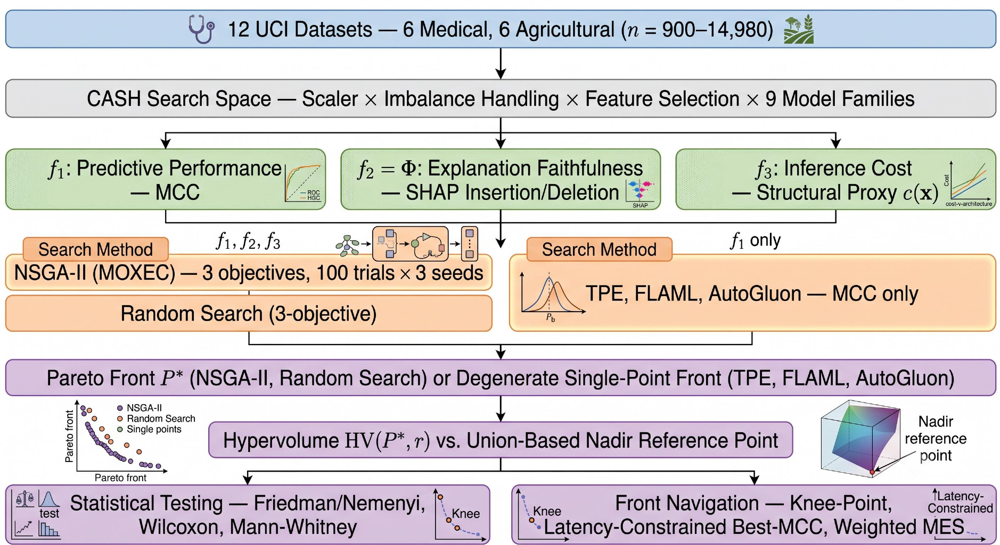
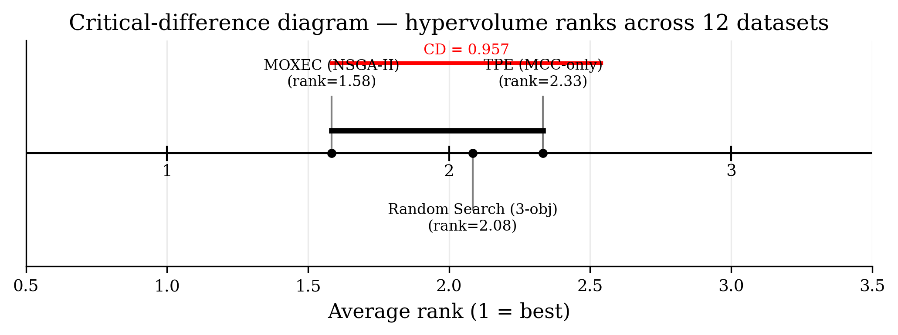
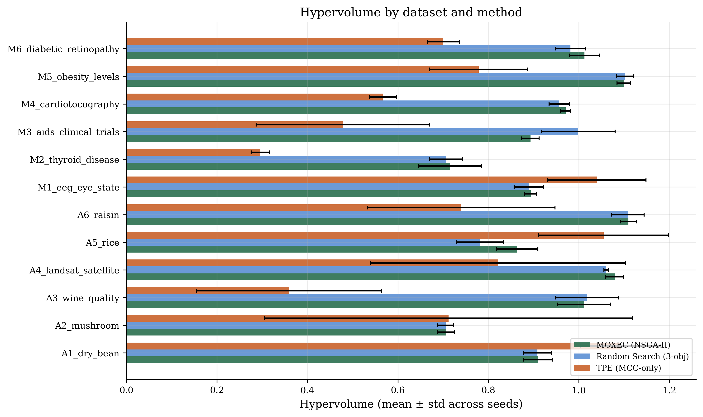
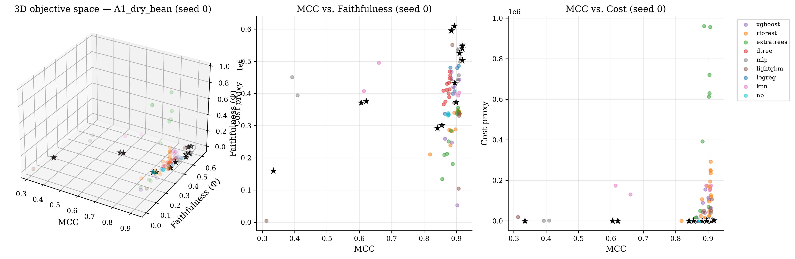

# MOXEC: Multi-Objective Automated Machine Learning for Accuracy, Explanation and Computational Complexity

---

## Abstract

Most AutoML systems optimize a single objective, usually predictive accuracy,
leaving explainability and computational cost as afterthoughts. This work
formulates tabular model selection as a three-objective search over predictive
performance (MCC), explanation-oriented utility (an insertion/deletion-AUC
measure of SHAP attribution behavior), and structural computational complexity
(a hardware-independent structural proxy), solved with NSGA-II over a
nine-family search space. The search returns a Pareto front rather than a
single model, making the accuracy-explanation-complexity trade-off explicit
rather than leaving it implicit in a single scalar score.

The formulation is evaluated on twelve UCI benchmarks, six medical and six
agricultural, against four baselines: FLAML, AutoGluon, a 100-trial random
search over the same objectives, and a 100-trial TPE search over MCC alone.
Measured by hypervolume across three seeds, the three-objective search
outperforms TPE on 8 of 12 datasets (Wilcoxon, *p* = 0.021) and random search
on 9 of 12 (*p* = 0.204, not significant). A domain-contrast test finds no
difference in gain between domains (Mann–Whitney *U* = 18, *p* = 1.0). On raw
MCC, the search matches or exceeds FLAML and AutoGluon on ten of the twelve
datasets. The claim is accordingly narrower than "a better AutoML system": an
empirically characterized Pareto front gives practitioners an explicit
accuracy-explanation-complexity choice, at the same trial budget
single-objective search would spend making that choice implicitly.

This repository is the code companion to the manuscript — everything needed
to reproduce the experiments above. Generated results, the manuscript source,
and journal submission packages are not included here.

<p align="center">
  
</p>

---

## 1. Method

| Objective | Metric | Direction |
|---|---|---|
| $f_1$ — Predictive performance | MCC | maximize |
| $f_2 = \Phi$ — Explanation faithfulness | SHAP insertion/deletion AUC | maximize |
| $f_3$ — Inference cost | Structural proxy (nodes / parameters / support vectors) | minimize |

**Search.** `optuna.samplers.NSGAIISampler`, 100 trials × 3 seeds, over a joint
preprocessing-plus-model CASH space: 4 scalers × 3 imbalance handlers ×
feature selection × 9 model families (logistic regression, decision tree,
random forest, extra trees, XGBoost, LightGBM, KNN, Gaussian NB, MLP).
Every scaler/resampler is fit **inside** the training fold
(`imblearn.Pipeline`) — no leakage. Objectives are averaged over stratified
5-fold CV.

**Baselines**, same folds and seeds: FLAML, AutoGluon (`medium_quality`),
random search (same 3 objectives, 100 trials), and single-objective TPE (MCC
only, 100 trials).

**Evaluation.** Hypervolume against a union-of-methods nadir reference point,
Friedman + Nemenyi across all three search methods, a portfolio-level
Wilcoxon signed-rank test, a Mann–Whitney medical-vs-agricultural domain
contrast, and three front-navigation rules (knee-point, cost-constrained
best-MCC, weighted scalarization).

### Dataset portfolio

Twelve UCI classification datasets (*n* ≥ 900), loaded via `ucimlrepo`:

| Key | Dataset | UCI id | Size | Target |
|---|---|---|---|---|
| M1 | EEG Eye State | 264 | 14,980 × 14 | Binary |
| M2 | Thyroid Disease (ann-thyroid) | 102 | 7,200 × 21 | 3-class, high imbalance |
| M3 | AIDS Clinical Trials Group Study 175 | 890 | 2,139 × 23 | Binary |
| M4 | Cardiotocography | 193 | 2,126 × 21 | 3-class |
| M5 | Estimation of Obesity Levels | 544 | 2,111 × 16 | 7-class |
| M6 | Diabetic Retinopathy (Debrecen) | 329 | 1,151 × 19 | Binary |
| A1 | Dry Bean | 602 | 13,611 × 16 | 7-class |
| A2 | Mushroom | 73 | 8,124 × 22 | Binary, categorical |
| A3 | Wine Quality (red + white) | 186 | 6,497 × 11 | Binarized (≥6 vs <6) |
| A4 | Statlog (Landsat Satellite) | 146 | 6,435 × 36 | 6-class |
| A5 | Rice (Cammeo and Osmancik) | 545 | 3,810 × 7 | Binary |
| A6 | Raisin | 850 | 900 × 7 | Binary |

---

## 2. Results

### Portfolio hypervolume

Mean ± std hypervolume across 3 seeds (values above 1.0 are expected — the
reference point sits a 5% margin beyond the normalized objective space,
giving a theoretical ceiling of ≈1.158, not 1.0). MOXEC's three-objective
NSGA-II search outperforms random search on **9 of 12** datasets and
single-objective TPE on **8 of 12**.

| Key | Domain | MOXEC (NSGA-II) | Random Search | TPE (MCC-only) |
|---|---|---|---|---|
| M1 | medical | 0.894 ± 0.013 | 0.889 ± 0.032 | **1.040 ± 0.108** |
| M2 | medical | **0.716 ± 0.070** | 0.707 ± 0.037 | 0.296 ± 0.020 |
| M3 | medical | 0.893 ± 0.019 | **0.999 ± 0.082** | 0.478 ± 0.192 |
| M4 | medical | **0.971 ± 0.011** | 0.957 ± 0.022 | 0.567 ± 0.030 |
| M5 | medical | 1.100 ± 0.015 | **1.103 ± 0.019** | 0.779 ± 0.108 |
| M6 | medical | **1.013 ± 0.033** | 0.981 ± 0.033 | 0.700 ± 0.036 |
| A1 | agriculture | 0.910 ± 0.031 | 0.908 ± 0.031 | **1.093 ± 0.089** |
| A2 | agriculture | 0.706 ± 0.019 | 0.706 ± 0.018 | **0.712 ± 0.407** |
| A3 | agriculture | 1.011 ± 0.059 | **1.018 ± 0.070** | 0.359 ± 0.204 |
| A4 | agriculture | **1.079 ± 0.020** | 1.061 ± 0.005 | 0.821 ± 0.282 |
| A5 | agriculture | 0.864 ± 0.046 | 0.781 ± 0.052 | **1.055 ± 0.144** |
| A6 | agriculture | **1.110 ± 0.017** | 1.108 ± 0.036 | 0.740 ± 0.207 |

<p align="center">
  <br>
  
</p>

**Statistical significance.** A Friedman test across all twelve datasets and
three methods gives χ² = 3.50, *p* = 0.174 (not significant — 12 datasets is
a modest sample for a rank-based test). The portfolio-level Wilcoxon
signed-rank test is sharper: MOXEC vs. TPE, *W* = 10.0, **p = 0.021**
(significant); MOXEC vs. random search, *W* = 22.0, *p* = 0.204 (not
significant). Read together: the gain from optimizing three objectives
jointly instead of MCC alone is the more robust finding in this portfolio.

**Domain contrast.** Mann–Whitney *U* on per-dataset hypervolume gain
(MOXEC − random search), medical vs. agricultural: *U* = 18.0, *p* = 1.0 — no
detectable dependence on domain.

### Per-objective breakdown

MOXEC's best-found MCC matches or exceeds both FLAML and AutoGluon on **10 of
12 datasets**, trailing narrowly on Thyroid Disease and Rice. The largest
margin is on Diabetic Retinopathy — the smallest, noisiest dataset in the
portfolio — where MOXEC's MCC (0.511) exceeds FLAML (0.336) and AutoGluon
(0.353) by a wide margin.

The two auxiliary objectives are dataset-dependent optimization signals, not
universal replacements for direct measurement: the faithfulness correlation
meets the *ρ* ≥ 0.80 operational threshold on 7 of 12 datasets, and the
structural-cost proxy's correlation with measured latency ranges from strong
(*ρ* = 0.89 on A3, A5) to inverted (*ρ* = −0.71 on A6). This is reported as a
dataset-specific reliability caveat, not a defect in the search itself, since
hypervolume on the affected datasets is not uniformly weaker.

<p align="center">
  
</p>

*Representative Pareto front (A1 Dry Bean, seed 0), annotated by model
family. No single family dominates the front — tree ensembles sit toward the
high-MCC, higher-cost end; simpler linear and shallow-tree configurations
populate the low-cost end at a real reduction in predictive performance.
This is the trade-off the method is built to expose.*

### Ablations and front navigation

| Ablation | Result |
|---|---|
| A1 — 3-objective vs. MCC-only, equal budget | MOXEC wins **8/12 (67%)** — significant (Wilcoxon *p* = 0.021). This is the paper's central result. |
| A2 — NSGA-II vs. random search, equal budget | MOXEC wins **9/12 (75%)** — directionally favorable, not yet significant (*p* = 0.204). |

| Front-navigation agreement | Datasets |
|---|---|
| All three rules (knee-point, cost-constrained, weighted MES) agree | 4/12 (33%) |
| Knee-point and weighted MES agree | 8/12 (67%) |

A Pareto front is not directly actionable — which navigation rule a
practitioner adopts changes which configuration they walk away with on
roughly two-thirds of the datasets studied.

---

## 3. Repository structure

```
.
├── full_pipeline/            Standalone server script — the primary way to reproduce results
│   ├── moxec_full_pipeline.py
│   ├── requirements.txt
│   └── README.md
├── notebooks/                 Colab/Kaggle notebook alternatives (no server needed)
│   ├── MOXEC_single_dataset_experiment.ipynb
│   ├── MOXEC_kaggle_full_pipeline.ipynb
│   ├── MOXEC_aggregate_results.ipynb
│   └── README.md
└── docs/
    ├── architecture.pdf / .png    Pipeline architecture diagram
    └── results/                    Figures shown in §2 above
```

This repository contains only the code and figures needed to reproduce and
present the experiments above. Generated run outputs, the manuscript LaTeX
source, and journal submission packages are kept locally and excluded via
`.gitignore`.

---

## 4. Reproducing the results

The **recommended** path is the standalone server script — it runs unattended,
resumes automatically after interruption, and is the most complete, most
recently corrected version of the pipeline (see
[`full_pipeline/README.md §6`](full_pipeline/README.md#6-two-correctness-fixes-baked-into-this-script-worth-knowing-about)
for two correctness fixes worth knowing about before trusting any numbers).

```bash
cd full_pipeline
python3 -m venv venv && source venv/bin/activate
pip install -r requirements.txt

# Smoke test first — verifies the whole pipeline end to end in about a minute
python moxec_full_pipeline.py \
  --datasets A6_raisin --n-trials 1 --n-seeds 1 \
  --no-autogluon --baseline-time-budget-sec 20 \
  --output-dir ./smoke_test_outputs

# Full run (25-40+ hours for all 12 datasets — see full_pipeline/README.md §9)
python moxec_full_pipeline.py --output-dir ./outputs
```

See [`full_pipeline/README.md`](full_pipeline/README.md) for the complete CLI
reference, output layout, and troubleshooting table.

No server available? Use the notebooks in [`notebooks/`](notebooks/) instead
— they run the same pipeline interactively on Colab or Kaggle's free tier.
See [`notebooks/README.md`](notebooks/README.md).

**Requirements:** Python 3.9–3.13, CPU-only. See
[`full_pipeline/requirements.txt`](full_pipeline/requirements.txt) — core
stack plus `optuna`, `shap`, `imbalanced-learn`, `xgboost`, `lightgbm`,
`flaml`, `autogluon.tabular`, `scikit-posthocs`, and `pymoo`.

---

## Citation

This code accompanies the manuscript *"MOXEC: Multi-Objective Automated
Machine Learning for Accuracy, Explanation and Computational Complexity."*
A formal citation (authors, venue, year, DOI) will be added here once the
paper is published.
